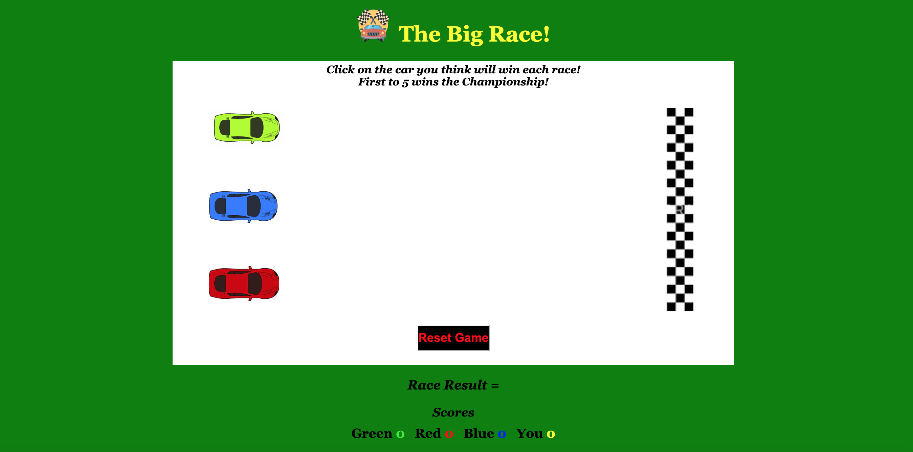
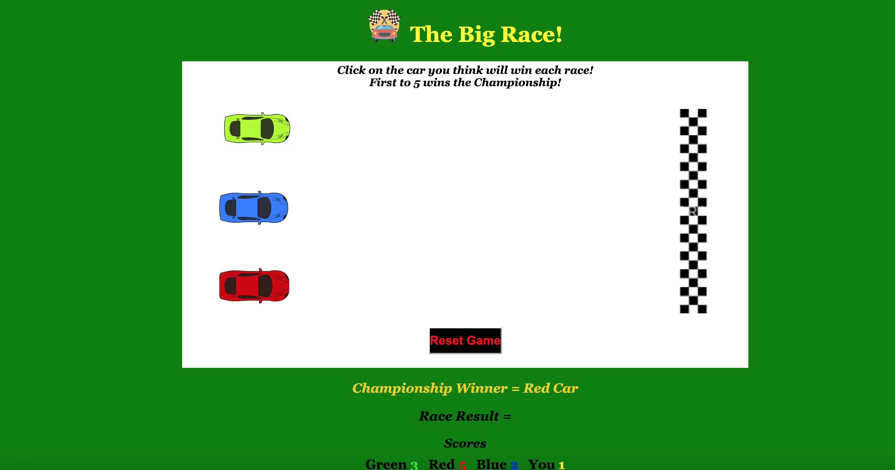

# The Big Race!

The Big Race is a gaming website which offers the user an opportunity to play a race car game.  The instructions are simple, the user must pick a race winner with three cars to choose from.  Each time the user selects the correct car, they receive a point.  Each time a particular car wins, that colour of car receives a point.  If its a draw, no points are allocated.  The game continues until a car, the user or both get to 5 points.
The page is very clearly laid out with clear instructions to the user in order to carry out the game, and in order to complete the individual races and ultimately the game is really simple and requires only a mouse click by the user.
Its a fun game in which users of any age can enjoy and even compete among friends!

# Features 

As a one page WebSite, the 'features' are minimial.  Although I have added a number of subtle features to allow for the ease of use and enjoyment for the user.

- __Click on Car__

    - In order for the user to kick off the game (instructions added), the user can click on any of the cars.  This is the car they are choosing to win the race.  While the user mouses' over the cars, they enlarge.  Once the user clicks on the Car, the race begins.  Each time the race restarts, the user must then repeat this task.

- __Automatic race restart__ 

    - I originally had two buttons on the screen, one for rest race and another for reset game.  Reset race was to bring the cars back to the start line, reset game was to completely reset all scores and race. 
    I decided that it would be slicker, to make the resetting of the race automatic.  So when the race finishes (last car comes in) all cars will bring themselves back to the start line, in which the user must select another car.  I felt this was cleaner than asking the user to select a button every time a race ends. 

- __Reset Game__

    - There is a button to reset the game, which means the whole 'competition' will re-start.  Thi will reset all scores and also bring the cars back to the starting line.

- __Scoring__

    - This was probably the most complicated part of the project.  I had to try and determine which car won the race, and also whether the user had chosen the winner.  Based on the previous, that would determine the scores.  Scores are based on the individual cars plus the user.  If the car wins and the user selected correct then both the car and the user scores 1 point.  If the car wins and the user did not select, the car gets a point.  If the user selects the correct car, the car and the user gain a point. 

- __Scoring_Display__

    - There is a scores display area which displays each car plus the user scores.  These numbers increment automatically based on the results of each race.  These scores also go towards determining the overall winner. 

- __Determining the winner__

    - The first to five wins the overall competition.  The score has to be determined when taking into consideration wins, draws and individual collective results.  When a particular car and/or user wins, there will be a message which appears to display this winner in a flashing animation.  *bug - when two different winners happen, only one displays.  
    I also had to determine the winner due to random number of race duration rather than an image crossing the line.
    

- __Game Restart__

    - When the game ends (5 is reached), the screen will display the winner, and after a few seconds a reset of the race and the whole game, so the new 'game' can start again.

 ### Features Left to Implement

  - I would like to add a further car to the race and to allow a user to select a car for the full game...so they stick with the same car throughout.
  - Another idea is to allow the user to select a particular type of car.. so I could have offered different cars to race.
  - When a championship is won, perhaps a bigger (better) award presentation.  Maybe a trophy image presented on screen.
  - I would like to perhaps make the race a bit quicker, some feedback is that it can take a car a long time to finish the race (up to 7 seconds).  If I were to do this again, I would perhaps look at making the random number to 1 decimal and have the numbers between 2-4. 
  - After using on a device, I think having the game play on Landscape may have been a good idea.

  ## Testing

  - The testing of this project was really deep.  I thought of an idea and went with it, and tried to get it to work through trial and error.  The bulk of my testing was carried out during the development period, rather than post development.  The majority of my testing was a natural stage of development and not documented.  Every single piece and version of my code was tested, as that was what is required to ensure that it actually does what one would hope.  

  - The deepest testing came from trying to distinguish the distance of the race in relation to the screen size.  This took quite a long time and changing of code.  *Bug - depending on the size of screen, the cars will travel beyond the finish line, and even screen. I added a function to allow for screen size and length of race.

  - The game I chose was particularly difficult when attempting to be responsive.. its generally a tough game to carry out in a small space which can become smaller.  I spent quite a bit of time and trial and error with different screen sizes and mobile.  Its definitely not perfect, but its functional across devices and screen sizes.  The function i wrote to determine race length is :-  function screenWidth() .

  - I tested the product across Browsers without issue. I did not carry out the full range of user/feature tests across browser, but instead did 100% on chrome and 50% across browser by cherry picking key tests in regards race. [Browser Testing](https://drive.google.com/drive/folders/1EKGSoQa4eIWfCXsbogJ9xxnBe28wmN1-) 

  - All offical technical testing was carried out and passed in relation to good scores and without error (Lighthouse, Jshint, CSS validator). [Code Testing](https://drive.google.com/drive/folders/1tRKz-6E12cBpUkQMVV4lBziFoajAmrc6)
  **Bug - I was receiving a poor score on Best practise because of the size and ratio of images... I had smaller cars, but had to enlarge and use as original size to pass this.  I think the cars are a bit big.

  - Responsiveness testing - I tested my website on different screen sizes and smaller devices.  In hindsight, a race is not the easiest to accomplish on smaller screen sizes!  I managed to accomplish this to allow the site to still be useable and visually ok, but its not perfect.  See [Screen and Device Testing](https://drive.google.com/drive/folders/1kmpnXYoxblivHhUHUfHhndPJSxhHw0sH)

  - User story and feature testing - My website is somewhat straight forward from an end user point of view, so the user stories are quite minimal, but I have still listed out and detailed the testing of these, the feature testing is much more comprehensive.  I still don't think the list of tests will do the amount of testing that was carried out justice, as it took 100s of tests of the same feature to accomplish what was required.  Please find USer Story and feature testing here - [User Story and Feature Testing](https://docs.google.com/spreadsheets/d/1KsQf9enNtaa6bZmAcmcCaRmnD_h3sid6H6iKpDpMRNc/edit#gid=0)

  ### Unfixed Bugs
  - There are a few in which I have detailed in the testing notes.  Its not perfect on different screen sizes, race length being an issue.  Car sizes also not ideal as I was trying to keep the lighthouse testing green (it insisted on original image sizes)
  - A user can click on the car when its resetting and kick the race off again before completely reset.  I am unable at this point to fix that issue.
  - If two cars get to 5 only one is determined the winner, the message only displays one car.

  ## Original Wireframe

- Before jumping into coding, I wanted to first put some thought into the idea and design of my Website.  The original design did not change too much, but as I got into the project, I decided on changing a few UX items and layouts.  I am not sure what happened to my original plan, I can't locate it in Balsmaiq.  To try and describe, I had firstly gone with three people in a run race and the race course being vertically set up.  Colours completely different.. the colours changed quite a bit to alow for messaging in correct colours and clarity for accessibility. 

## Deployment

- The site was deployed to GitHub pages. The steps to deploy are as follows: 
  - In the GitHub repository, navigate to the Settings tab 
  - From the source section drop-down menu, select the Master Branch
  - Once the master branch has been selected, the page will be automatically refreshed with a detailed ribbon display to indicate the successful deployment. 

The live link can be found here - https://kevinmcsherry.github.io/P2_the_big_race/

## Credits 

I used a number of different websites and did a lot of searching throughout the project.  I really tried to understand the logic that I was finding and implement in my own code, and not just copy and paste in.  I may have lost a lot of time here, but I wanted to understand and learn.
I used image and photo website referenced below and well known coding sites like Stackoverflow and W3Schools.  I would have really struggled without these reference points.

### Content 

- For the standard layout of the screen I used the 'love Maths' as a boiler plate.

- Rightly or wrongly, I really tried to use what I had learned through the course and general web searches on how to structure and code my functions.  I did many searches and I was using [Stackoverflow](https://stackoverflow.com/) and [W3 Schools](https://www.w3schools.com/) quite a lot.  There are lots of great snippets of ideas here that helped me a lot.

- I used the Love Maths project to help inspire me to overall site layout and used the code here to help with the responsiveness media queries.

- I added some animation to the instruction text for the game.  I received feedback that it was easy to miss. I found a great link in W3Schools that had information on animations in CSS. [W3Schools_Text_animation](https://www.w3schools.com/css/css3_animations.asp)

### Media

- The car images were taken from [Google_images](https://www.google.com/search?q=red+car+images&sxsrf=ALiCzsbqbILsgTPkzVBCi4Aj3Fe-JRHzMQ:1664220191372&source=lnms&tbm=isch&sa=X&ved=2ahUKEwiMp9aql7P6AhWBQEEAHRocAvsQ_AUoAXoECAIQAw&biw=1440&bih=703&dpr=2) when I searched for 'Red/green/blue car images'

### Project Summary

- For this project I wanted to do something different than the standard games that were being suggested.  Like the firt project, I was very keen to stamp my own style and coding on it, and not rely too heavily on other sources of code.  I really enjoyed working with javascript and got to the end line through trial and error mostly.  
I feel that this project allowed me to utilise a lot from what the content had taught and required using quite a few areas of coding (functions, variables, if/else, loops, conditions, parameters).  I am proud that I did not copy and paste any code, but instead learned, understood and applied.
The game is not perfect and there are still a few things that could be better as explained, but overall I think its an enjoyable game and has some cool features that are coded well.

